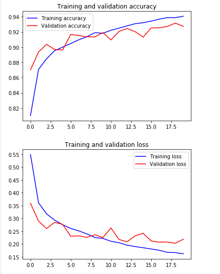
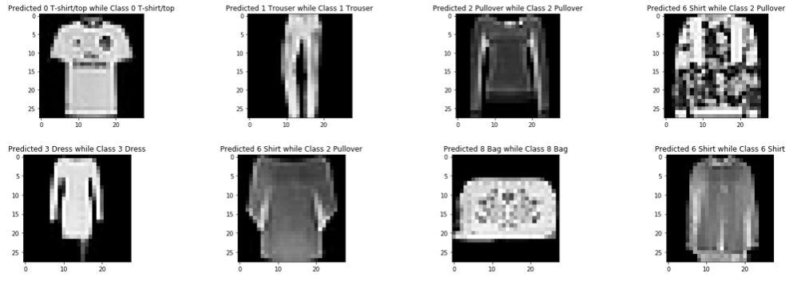

# Convolutional Neural Network on the Fashion-MNIST Dataset

This was one of my first learning projects, which i had the chance to work on thanks to Data Co-lab, an organization of Data Science enthusiast engineers that work on amazing projects and make amazing impact on the tunisian Machine Learning scene (here's their website if you want to know more about them http://www.data-co-lab.com/)

The project is basically an implemetation of a Convolutioan Neural Network multiclassifier which takes a 28 by 28 image from the famous alternative Fasion-MNIST dataset (which is the new one used for benchmarksn, it can be found here https://github.com/zalandoresearch/fashion-mnist), and outputs a classification of it into one of 10 classes.

Check the ipynb file for the implementation !

# Training and Validation graph of the model 

 
 
 # Visualizing some of the predictions we obtained  

 
